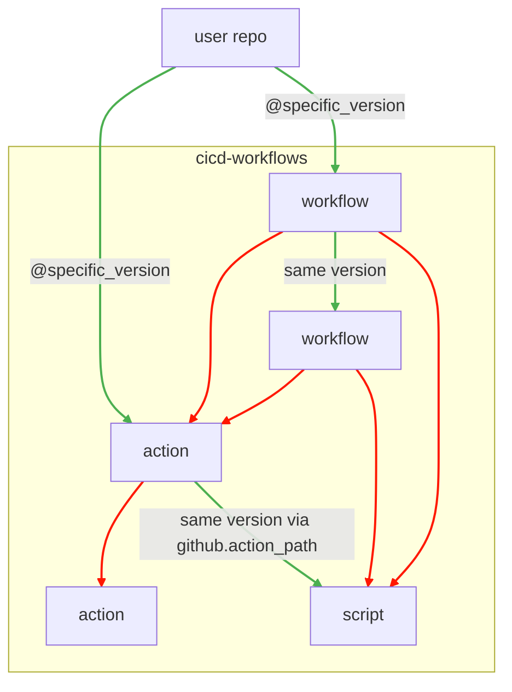

# Design of Workflows, Actions and Scripts

```mermaid
%%{ init: { "flowchart": { "defaultRenderer": "dagre" } } }%%

flowchart TD
  UR["user repo"]
  subgraph cicd-workflows
    WF1["workflow"]
    WF2["workflow"]
    A1["action"]
    A2["action"]
    S1["script"]
  end

  %% Versioned user calls
  UR -- "@specific_version" --> WF1
  UR -- "@specific_version" --> A1

  %% Same-version calls
  A1 -- "same version via github.action_path" --> S1
  WF1 -- "same version" --> WF2

  %% impossible calls
  WF2 --> S1
  WF1 --> A1
  WF1 --> S1
  A1 --> A2
  WF2 --> A1
  
  %% Arrow styles (edge indices: 0, 1, 2, 3, ...)
  linkStyle 0 stroke:#4caf50,stroke-width:2px
  linkStyle 1 stroke:#4caf50,stroke-width:2px
  linkStyle 2 stroke:#4caf50,stroke-width:2px
  linkStyle 3 stroke:#4caf50,stroke-width:2px

  linkStyle 4 stroke:#ff1800,stroke-width:2px
  linkStyle 5 stroke:#ff1800,stroke-width:2px
  linkStyle 6 stroke:#ff1800,stroke-width:2px
  linkStyle 7 stroke:#ff1800,stroke-width:2px
  linkStyle 8 stroke:#ff1800,stroke-width:2px
```
