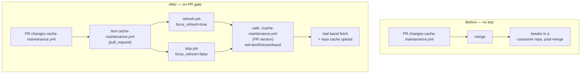

# Design: On-PR testing for `cache-maintenance.yml`

**Date:** 2026-07-18
**Status:** Proposed
**Scope:** `score_cicd-workflows` (this repo) + a small feature addition in `score_cicd-actions`

---

## Why

`cache-maintenance.yml` is a reusable (`workflow_call`) workflow that fetches Bazel
dependencies for a set of variants and manages the shared GitHub Actions caches. Today it
has **no automated test**. A typo in an `if:` expression, a broken action reference, or a
change that quietly stops populating the repository cache would only surface in a consumer
repository — after merge, in production.

We want a test that catches these regressions **on every pull request that touches the
workflow**, because a test that only runs on demand "doesn't get used by anyone." The test
must exercise the workflow **for real**: an actual `bazel fetch` against an actual Bazel
workspace, producing an actual repository cache. Mocking the Bazel layer would defeat the
purpose.

Three properties of the workflow make this non-trivial:

1. **It needs a Bazel workspace.** The workflow runs `bazel fetch`, but `score_cicd-workflows`
   is a workflows repo — it has no `MODULE.bazel`. Something has to provide one.
2. **The refresh decision is derived from git history, not an input.** The
   `repository-cache-check` action decides `should_refresh_cache` by diffing
   `MODULE.bazel.lock` (via `tj-actions/changed-files`). A PR that changes only the workflow
   file does not touch the lock, so real detection returns `false` and *every* subsequent
   step is skipped — the test would run empty.
3. **It contains destructive cache operations.** The `prune_old_caches` job deletes caches
   repo-wide. We must be sure a test run cannot destroy anything that matters.

## What

### Guiding decisions

These were settled during brainstorming and shape the design:

- **On-PR is mandatory.** The primary trigger is `pull_request`; a `workflow_dispatch`
  trigger is added alongside for manual / script-driven runs.
- **Detection is already tested where it lives.** `repository-cache-check` and
  `repository-cache-refresh` have their own tests in `score_cicd-actions`. This test does
  **not** re-test the lock-diff detection. It tests *this workflow's* wiring: given a refresh
  decision, do the right steps run, and does a real fetch + cache upload succeed?
- **Test logic stays out of the actions.** The one knob the test needs — forcing the refresh
  decision — lives **only in `cache-maintenance.yml`**, which *skips* the check action when
  the knob is set. The actions receive no test-only inputs.
- **The one action change is a real feature, not a test hack.** `repository-cache-refresh`
  gains a `working-directory` input so `bazel fetch` can run outside the repo root. This is
  genuinely useful for any consumer whose Bazel project is not at the repo root; it also lets
  our fixture live in a subdirectory so `main` stays clean.

### Topology: before and after



The test caller references the workflow under test with the **local** path
`./.github/workflows/cache-maintenance.yml`, so it always exercises the **PR's version** of
the workflow — not what is on `main`.

### Component 1 — `repository-cache-refresh` gains `working-directory` (in `cicd-actions`)

A new input `working-directory` (default `.`). The composite action changes directory into
it before running `bazel fetch`. Default behaviour is unchanged for every current caller.

This is the **only** change in `cicd-actions`. It carries no knowledge that a test exists.
Adding the same input to `repository-cache-check` is optional and out of scope here — the
test skips that action, and non-root detection is a separate concern.

### Component 2 — `cache-maintenance.yml` gains the override + passes `working-directory`

Two new inputs on the reusable workflow:

- `working-directory` (string, default `.`) — forwarded to `repository-cache-refresh`.
- `force_refresh` (string, default `''`) — **testing/debugging only.** Empty in production.
  When set to `'true'` or `'false'`, it overrides the refresh decision.

The decision flow becomes:

- `repository-cache-check` runs **only** when `force_refresh == ''` (i.e. in production).
- A small decision step computes the effective `should_refresh_cache`: the value of
  `force_refresh` when set, otherwise the check action's output.
- Every downstream `if:` gate — and the `prune_old_caches` job condition — reads this single
  effective value.

The result: in production the behaviour is byte-for-byte what it is today; under test the
lock-diff detection is bypassed and the workflow is driven straight down the chosen branch.
This mirrors the existing `_skip_cache_delete` "debugging only" input on
`repository-cache-refresh` — a test knob that lives with the thing it controls.

### Component 3 — Robustness fix in `prune_old_caches`

The current delete step pipes cache IDs into `xargs -n1 gh cache delete`. When the upstream
filter matches nothing, **GNU `xargs` still runs the command once with no argument**, so
`gh cache delete` is invoked without a cache ID and fails. In `score_cicd-workflows` there
are no `-disk-` caches, so the filter is always empty and the test's refresh job would fail
here for a reason unrelated to what it is testing.

Fix: add `-r` (`--no-run-if-empty`) to the `xargs` invocation. This is a genuine robustness
bug the test surfaces, not a test-only workaround.

### Component 4 — Bazel fixture (`test/fixtures/bazel/`)

A minimal, self-contained Bazel workspace whose only job is to give `bazel fetch` something
real but cheap to do:

- `MODULE.bazel` with two or three small, fast `bazel_dep`s.
- `MODULE.bazel.lock` (committed, so fetch is deterministic and offline-resolvable).
- `.bazelversion`.
- A trivial `BUILD.bazel` target so `//...` resolves.

It lives in a subdirectory — enabled by the `working-directory` feature — so `main` does not
masquerade as a Bazel project.

### Component 5 — `test-cache-maintenance.yml` (the test caller)

```
on:
  pull_request:
    paths:
      - .github/workflows/cache-maintenance.yml
      - .github/workflows/test-cache-maintenance.yml
      - test/fixtures/bazel/**
  workflow_dispatch:
```

Two jobs, both calling `./.github/workflows/cache-maintenance.yml` with
`working-directory: test/fixtures/bazel` and `variants: //...`:

| Job | `force_refresh` | Exercises | Asserts |
|-----|-----------------|-----------|---------|
| `refresh` | `'true'` | full path: checkout → setup → real `bazel fetch` → cache upload → (harmless) prune | workflow succeeds; a repository cache with the expected name exists (`gh cache list`) |
| `skip` | `'false'` | the no-op path: all guarded steps skipped | workflow succeeds (gating wiring is correct) |

The `paths` filter keeps the (bazel-running) test off unrelated PRs. `workflow_dispatch`
remains available for manual runs and for the script-driven pattern used elsewhere.

### Why the destructive operations are safe here

In `score_cicd-workflows` the only caches that exist during a test run are the ones the test
itself creates:

- The `gh cache list | select("-disk-")` filter matches nothing (no consumer builds run
  here) — made safe against the empty-input failure by the `xargs -r` fix above.
- `prune-cache` keeps only the newest generation *per cache family*; the only family present
  is the test's own, so there is nothing harmful to prune. (`prune-cache` also has its own
  `dry-run` input if we ever want belt-and-braces.)

No skip-deletion input is needed on the workflow.

## Changes

- **`cicd-actions` · `repository-cache-refresh/action.yml`** — add `working-directory` input
  (default `.`); `cd` into it before `bazel fetch`. No behaviour change for existing callers.
- **`cicd-workflows` · `.github/workflows/cache-maintenance.yml`**
  - add `working-directory` input, forward to `repository-cache-refresh`;
  - add `force_refresh` input (testing only, default `''`); gate `repository-cache-check`
    behind `force_refresh == ''`; compute one effective `should_refresh_cache`; point all
    downstream gates and the `prune_old_caches` job at it;
  - `prune_old_caches`: `xargs` → `xargs -r` (robustness fix).
- **`cicd-workflows` · `test/fixtures/bazel/`** — new minimal Bazel workspace.
- **`cicd-workflows` · `.github/workflows/test-cache-maintenance.yml`** — new test caller,
  `pull_request` (paths) + `workflow_dispatch`, `refresh` and `skip` jobs.

## Non-goals

- Re-testing the `MODULE.bazel.lock` diff detection — already covered in `cicd-actions`.
- Testing against the real (large, QNX-bearing) consumer project — that stays a separate
  `workflow_dispatch` / scheduled concern; the fixture deliberately trades fidelity for speed.
- Adding `working-directory` to `repository-cache-check` — not needed for this test.

## Risks and open points

- **Fixture flakiness / speed.** The chosen `bazel_dep`s must be small and reliably
  fetchable. If registry fetches prove flaky, the existing retry loop in
  `repository-cache-refresh` covers it, but dep choice should still favour tiny, stable
  modules.
- **Fork PRs.** On PRs from forks, `GITHUB_TOKEN` is read-only for Actions and secrets are
  unavailable. The fixture needs no QNX secrets (the workflow already guards QNX behind a
  presence check), and the test skips cache deletion; the `gh cache list` assertion should
  tolerate the reduced-permission case.
- **Cross-repo change ordering.** The `working-directory` input must land in `cicd-actions`
  (and the workflow must reference a ref that includes it) before the test can pass.
